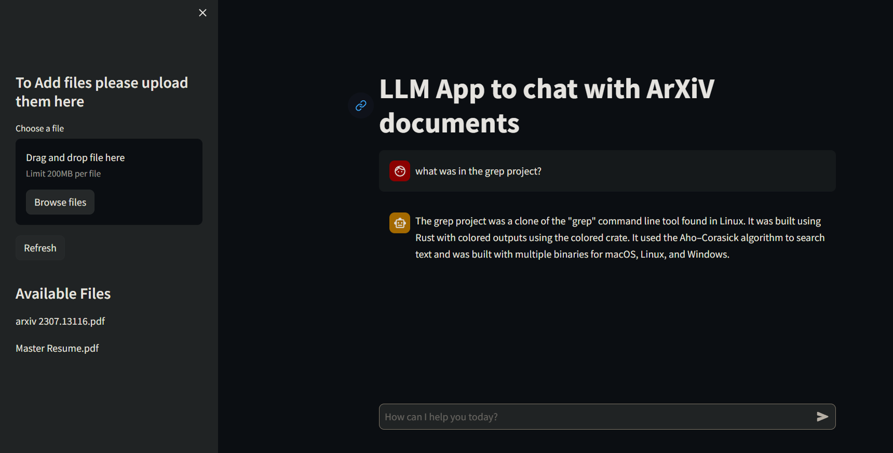

# LLM App for Arxiv Q&A 📚

This is an application built with Pathway's LLM-App and Streamlit as the user interface. The purpose of this app is to facilitate question and answer tasks to enhance understanding of research papers from arxiv.com.


## Video Demo of the APP 🎥
<video src="https://github.com/rony0000013/arxiv-qa-llm-app/assets/103501472/0ae9ef1d-e1ff-45ef-8e4e-6b205f63517b" controls="controls" >
</video>

[ LINK for the Video ](https://youtu.be/BZjWr5ula0M)


## Description 📝

The app is build with the modification of exixting LLM-APP examples and iterating on them

The LLM App for Arxiv Q&A is designed to provide a user-friendly interface for performing question and answer tasks on research papers from arxiv.com. It leverages Pathway's LLM-App, which is a language model trained on a large corpus of scientific literature. By utilizing the LLM App, users can ask questions about research papers and receive accurate and informative answers.

The Pathway component plays a crucial role in this project by enabling efficient indexing and retrieval of documents without the need for a vector database. It also offers the capability to incorporate real-time data through Pathway's datasource pipeline.

The app is built using Streamlit, a Python library for creating interactive web applications. It provides a seamless and intuitive user experience, allowing users to easily navigate through research papers, ask questions, and obtain detailed answers.

In addition to the question and answer functionality, the app also integrates with the Gemini API, which enhances the capabilities of the LLM App. This integration allows users to perform document indexing, retrieve metadata, summarize texts, and aggregate responses for multiple documents and answers.

The app is deployed using Docker, making it easy to deploy and run on any platform. With just a few simple steps, users can clone the repository, set up the necessary environment variables, build and run the Docker image, and access the app in their browser.

Overall, the LLM App for Arxiv Q&A provides researchers, students, and anyone interested in scientific literature with a powerful tool for exploring and understanding research papers from arxiv.com. It combines the advanced capabilities of the LLM App with a user-friendly interface, making it accessible and valuable for a wide range of users.


## Features 🎁

- Question and answer functionality for arxiv.com research papers
- User-friendly interface powered by Streamlit
- Docker deployment for easy app deployment on any platform
- Integration with Gemini API for LLM tasks

## Summary of available endpoints 📊

This example spawns a lightweight webserver that accepts queries on six possible endpoints, divided into two categories: document indexing and RAG with LLM.
### Default url for backend `http://0.0.0.0:8000/`

### Document Indexing capabilities
- `/v1/retrieve` to perform similarity search;
- `/v1/statistics` to get the basic stats about the indexer's health;
- `/v1/pw_list_documents` to retrieve the metadata of all files currently processed by the indexer.

### LLM and RAG capabilities
- `/v1/pw_ai_answer` to ask questions about your documents, or directly talk with your LLM;
- `/v1/pw_ai_summary` to summarize a list of texts;
- `/v1/pw_ai_aggregate_responses` to make a summary of a question for different documents and answers;

## Prerequisites 📋

Before running the app, make sure you have the following installed:

- Python 3.x
- Git
- Docker

## Installation 💻

1. Clone the repository:

  ``` 'bash
  git clone https://github.com/rony000013/arxiv-qa-llm-app.git
  ```

2. Change into the project directory:

  ``` 'bash
  cd arxiv-qa-llm-app
  ```

3. Add Gemini API key to .env file OR create your api key from [GEMINI_API_KEY 🔑](https://makersuite.google.com/app/apikey)
  ```
  GEMINI_API_KEY=<YOUR_API_KEY>
  ``` 

4. Build and run the Docker Image

  ``` 'bash
  docker compose up
  ```
  
  ### **Must wait for 18-20 mins to build the image ⏳** 

  ### **After the container is started must wait 3-5 mins for the server to be setup properly ⏳**

5. Access the app in your browser at `http://localhost:8501`.



6. To Close the program 
  ``` 'bash
    docker compose down
  ```


## Future iprovements  🚀
  - add ability to directly search and fetch arxiv documents from the application
  - support for visual inputs for better Q&A
  - better summarization abilities

# Made with 🖤 by Rounak Sen
